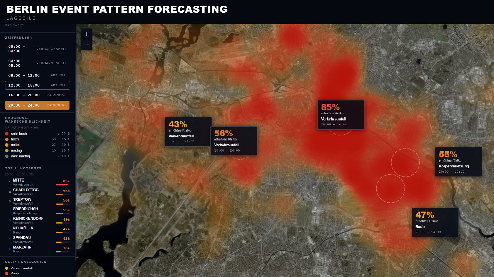

*Kartendaten: &copy; OpenStreetMap*

# Prognostische Modellierung raeumlich-zeitlicher Vorfallsmuster in Berlin

Lokale Pipeline und Oberflaechen fuer einen experimentellen Forschungsprototyp, der wahrscheinliche Kombinationen aus Bezirk, Zeitfenster und Kategorie auf Basis veroeffentlichter Berliner Polizeimeldungen rankt.

## Inhaltsverzeichnis

- [Disclaimer](#disclaimer)
- [Ziel](#ziel)
- [Vorarbeit](#vorarbeit)
- [Gemma-Pipeline](#gemma-pipeline)
- [Modellarchitektur V3](#modellarchitektur-v3)
- [Datenstand und letzter Evaluations-Snapshot](#datenstand-und-letzter-evaluations-snapshot)
- [Projektstruktur](#projektstruktur)
- [Lokales Setup](#lokales-setup)
- [Pipeline ausfuehren](#pipeline-ausfuehren)
- [Notebooks](#notebooks)
- [Weiterfuehrende Doku](#weiterfuehrende-doku)
- [Grenzen des aktuellen Standes](#grenzen-des-aktuellen-standes)
- [Hinweise fuer das Git-Repo](#hinweise-fuer-das-git-repo)

## Disclaimer

> **Wichtiger Disclaimer**
>
> Dieses Projekt beschreibt **keine belastbare Vorhersage realer Kriminalitaet in Berlin**. Das System modelliert ausschliesslich Muster in **oeffentlich veroeffentlichten Polizeimeldungen** und damit ein redaktionell gefiltertes, unvollstaendiges und potenziell verzerrtes Abbild des tatsaechlichen Geschehens.
>
> Dieses Projekt zielt nicht auf Personen, nicht auf Profile und nicht auf Vorverurteilung. Es erfasst ausschliesslich Muster in Raum, Zeit und Ereignistypen, bewertet keine Personen und darf niemals zur Vorverurteilung verwendet werden.
>
> Die Ausgaben dieses Prototyps sind **nicht** geeignet fuer:
> - operative Einsatzplanung
> - Ressourcensteuerung von Polizei oder Behoerden
> - Gefahrenbewertungen einzelner Orte
> - Bewertungen, Einstufungen oder Massnahmen gegenueber Personen oder Gruppen
>
> Das Projekt ist eine **private, unabhaengige Arbeit**. Es wurde weder im Auftrag noch in Zusammenarbeit mit Polizei, Behoerden, Politik oder anderen oeffentlichen Stellen entwickelt und steht in **keinem offiziellen, behoerdlichen oder oeffentlichen Anwendungskontext**.
>
> Das System ist ein **Forschungs- und Demonstrationsprojekt**. Es dient dazu, eine nachvollziehbare ML-Pipeline auf offenen Daten zu dokumentieren, nicht dazu, reale sicherheitsrelevante Entscheidungen zu unterstuetzen oder zu legitimieren. Massgeblich bleiben Ermittlungen, Einordnung durch Behoerden und rechtsstaatliche Verfahren. Validiert wird hier gegen oeffentliche Meldungen zu mutmasslichen Vorfaellen, nicht gegen juristisch abgeschlossene Schuldfragen.

Die ausfuehrlichere methodische sowie rechtlich-ethische Einordnung steht in [`docs/whitepaper.md`](docs/whitepaper.md).

## Ziel

Das Projekt erzeugt fuer ein Ziel-Datum ein Ranking der wahrscheinlichsten Zellen aus:

- Bezirk
- Zeitfenster
- Kategorie

Die aktuelle V3-Pipeline ist als Ranking- und Priorisierungssystem im Datenraum oeffentlicher Polizeimeldungen zu verstehen, nicht als praezise Ereignisvorhersage auf Einzelfallebene oder als Prognose realer Kriminalitaet.

## Vorarbeit

Bevor V3 trainiert werden kann, muessen die Rohmeldungen in eine modellierbare Struktur ueberfuehrt werden. Diese Vorarbeit besteht aus:

- inhaltlicher Strukturierung der Freitexte
- Extraktion und Normalisierung von Orts- und Zeitangaben
- Aufbau einer konsistenten Kategorisierung ueber alle Meldungen

Der aktuelle V3-Stand baut auf dieser Vorarbeit auf. Das Ranking-Modell arbeitet also nicht direkt auf Rohtext, sondern auf einer vorgelagerten, lokal erzeugten Datenbasis.

## Gemma-Pipeline

Die semantische Vorarbeit laeuft ueber eine lokale Gemma-Pipeline:

1. `src/1_extract_categories.py`
   Gemma analysiert ein Stichproben-Sample der Meldungen und schlaegt eine Taxonomie vor.
2. `src/2_classify_all.py`
   Gemma ordnet anschliessend jede Meldung genau einer Kategorie zu.
3. `src/time_parser.py`
   Zeitangaben werden in verwertbare Stunden- oder Bucket-Informationen ueberfuehrt.

Das Ergebnis dieser Vorarbeit landet lokal in `cache/` und bildet die Grundlage fuer das V3-Training.

## Modellarchitektur V3

V3 kombiniert zwei Modellteile:

1. `count_total(date, place, bucket)` ueber `MLForecast + CatBoostRegressor`
2. `category_share(date, place, bucket)` ueber `CatBoostClassifier`

Danach folgt ein Postprocessing-Schritt:

- Prior-Blending fuer stabilere Kategorieanteile
- Lift-Cap gegen ueberzogene relative Ausschlaege
- zwei Sortiermodi: `absolute` und `lift`

Die V3-Zielstruktur ist:

```text
date x place x time_bucket -> count_total
date x place x time_bucket -> category_share
count_total x category_share -> Ranking ueber place x bucket x category
```

## Datenstand und letzter Evaluations-Snapshot

Der zuletzt ausgewertete V3-Stand basiert auf Daten vom `2022-12-31` bis `2026-04-18`.

- `n_events`: `6505`
- `n_exact_events`: `5964`
- `exact_time_share`: `92.11%`
- `n_valid_categories`: `50`
- `n_places`: `13`
- `n_place_bucket_series`: `78`
- Trainingszeitraum: `2022-12-31` bis `2025-08-20`
- Validierungszeitraum: `2025-08-21` bis `2026-04-18`

Wesentliche Metriken des letzten V3-Laufs:

- Count-Modell: `mae = 0.1052`, `poisson_deviance = 0.2701`
- Count-Modell: `sum_true = 786`, `sum_pred = 1335.19`
- Share-Modell: `accuracy_top1 = 0.2112`
- Share-Modell: `accuracy_top3 = 0.3486`
- Share-Modell: `accuracy_top5 = 0.4300`
- Share-Modell: `f1_macro = 0.0125`
- Top-k Backtest: `precision_at_30 = 0.0152`, `recall_at_30 = 0.1356`
- Top-k Backtest: `precision_at_50 = 0.0128`, `recall_at_50 = 0.1947`

Kurz eingeordnet:

- Das Count-Modell ueberschaetzt das Gesamtvolumen aktuell deutlich.
- Das Share-Modell ist fuer Top-k-Rankings brauchbar, aber fuer seltene Klassen schwach.
- Der absolute Modus bevorzugt haeufige Kategorien wie `Verkehrsunfall`.
- Der Lift-Modus macht seltenere, relativ auffaellige Muster sichtbarer.

## Projektstruktur

Die fuer V3 relevanten Bereiche sind:

```text
.
|-- src/           # Pipeline, Training und App
|-- notebooks/     # enthaltene Repro- und Analyse-Notebooks
|-- docs/          # Whitepaper und aggregierte Dokumentation
|-- assets/        # README-Bild und weitere statische Assets
|-- data/          # lokale Rohdaten, nicht versioniert
|-- llm/           # lokales LLM, nicht versioniert
|-- cache/         # lokale Zwischenergebnisse, nicht versioniert
|-- models/        # lokale Modellartefakte, nicht versioniert
|-- logs/          # lokale Logs, nicht versioniert
|-- mlruns/        # lokales MLflow-Tracking, nicht versioniert
|-- requirements.txt
`-- README.md
```

Wichtige Einstiegspunkte:

- `src/1_extract_categories.py`
- `src/2_classify_all.py`
- `src/3f_train_topk_v3.py`
- `src/5b_app_topk.py`
- `src/5_1_app.py`
- `src/topk_forecasting_v3.py`

## Lokales Setup

```powershell
python -m venv .venv
.\.venv\Scripts\activate
python -m pip install -r requirements.txt
```

Danach muessen lokal befuellt werden:

- `data/` mit den Excel-Dateien `meldungen_YYYY.xlsx`
- `llm/` mit dem lokal verfuegbaren Gemma-Modell

Optional GPU pruefen:

```powershell
python -c "import torch; print(torch.cuda.is_available())"
```

## Pipeline ausfuehren

### 1. Kategorien erzeugen

```powershell
python src/1_extract_categories.py
```

Erzeugt lokal `cache/categories.json`.

### 2. Meldungen klassifizieren

```powershell
python src/2_classify_all.py
```

Erzeugt lokal `cache/classified_data.csv`.

### 3. V3 trainieren

```powershell
python src/3f_train_topk_v3.py
```

Optional mit Optuna:

```powershell
python src/3f_train_topk_v3.py --optuna-trials 20
```

Artefakte landen lokal unter `models/topk_forecaster_v3/`.

### 4. Oberflaechen starten

Zum Laden der Oberflaechen muessen die trainierten V3-Artefakte bereits lokal vorhanden sein. Erwartet wird `models/topk_forecaster_v3/` mindestens mit:

- `count_forecaster.pkl`
- `category_share_model.cbm`
- `encoders.pkl`
- `metadata.json`
- `category_share_priors.json`
- `series_lookup.csv`

Die Artefakte entstehen durch Schritt 3 oder koennen aus einem vorhandenen lokalen Modellstand stammen.

#### Streamlit-Apps

Die Streamlit-App `src/5b_app_topk.py` ist die explorative Analyseoberflaeche fuer das Ranking-Modell. Sie zeigt fuer ein Ziel-Datum die V2/V3-Prognosen in `absolute` und `lift`, fasst Modellkennzahlen zusammen und macht die wichtigsten Bezirke, Kategorien und Zeitfenster direkt im Repo-Kontext nachvollziehbar.

```powershell
streamlit run src/5b_app_topk.py
```

Die zusaetzliche App `src/5_1_app.py` fokussiert die count-basierte Tagesuebersicht sowie eine Bezirksansicht fuer Datum und Zeitfenster.

```powershell
streamlit run src/5_1_app.py
```

## Notebooks

Das Repo enthaelt bereits zwei Notebooks im Ordner [`notebooks/`](notebooks/):

- [`01_data_analysis_repro.ipynb`](notebooks/01_data_analysis_repro.ipynb)
- [`02_model_v3_repro.ipynb`](notebooks/02_model_v3_repro.ipynb)

Sie dienen der Reproduktion und Einordnung des aktuellen Stands:

- [`01_data_analysis_repro.ipynb`](notebooks/01_data_analysis_repro.ipynb) analysiert die aggregierten Artefakte aus `docs/analysis`
- [`02_model_v3_repro.ipynb`](notebooks/02_model_v3_repro.ipynb) analysiert die gespeicherten V3-Artefakte aus `models/topk_forecaster_v3`

Die Notebooks sind bewusst im Repo enthalten, weil sie den Projektstand nachvollziehbar machen. Wenn Outputs gespeichert werden, bleiben Tabellen und Plots direkt in der `.ipynb` erhalten und koennen mit Git versioniert werden.

## Weiterfuehrende Doku

- [`docs/whitepaper.md`](docs/whitepaper.md) beschreibt Datenbasis, Vorarbeit, Modelllogik und methodische Grenzen ausfuehrlicher.

## Grenzen des aktuellen Standes

- Das Modell sagt keine exakten Einzelfaelle vorher.
- Der Vorhersageraum ist stark sparse.
- Haeufige Kategorien dominieren im absoluten Ranking.
- Seltene Kategorien werden durch Priors und geringe Fallzahlen strukturell benachteiligt.
- Die aktuelle V3-Version ist eher fuer Priorisierung und Exploration geeignet als fuer harte operative Automatisierung.

## Hinweise fuer das Git-Repo

- Rohdaten, Modellgewichte, Cache-Inhalte, Logs und trainierte Artefakte sollen nicht versioniert werden.
- Leere Platzhalterordner koennen per `.gitkeep` erhalten bleiben, damit die lokale Struktur sichtbar ist.
