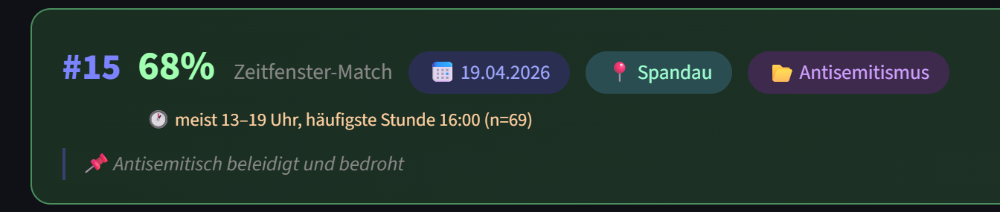
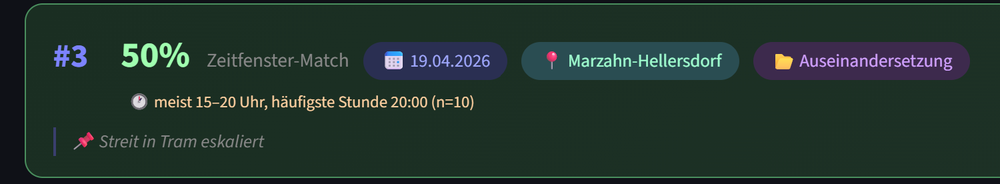
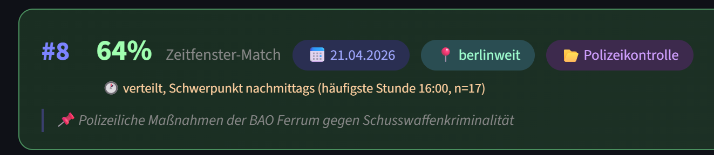

# Prognostische Modellierung räumlich-zeitlicher Vorfallsmuster in Berlin - Technisches Whitepaper

**Stand:** April 2026  
**Status:** Experimenteller Forschungsprototyp

---

> **Wichtiger Disclaimer**
>
> Dieses Dokument beschreibt **keine belastbare Vorhersage realer Kriminalität in Berlin**. Das System modelliert ausschließlich Muster in **öffentlich veröffentlichten Polizeimeldungen** und damit ein redaktionell gefiltertes, unvollständiges und potenziell verzerrtes Abbild des tatsächlichen Geschehens.
>
> Dieses Projekt zielt nicht auf Personen, nicht auf Profile und nicht auf Vorverurteilung. Es erfasst ausschließlich Muster in Raum, Zeit und Ereignistypen, bewertet keine Personen und darf niemals zur Vorverurteilung verwendet werden.
>
> Die Ausgaben dieses Prototyps sind **nicht** geeignet für:
> - operative Einsatzplanung
> - Ressourcensteuerung von Polizei oder Behörden
> - Gefahrenbewertungen einzelner Orte
> - Bewertungen, Einstufungen oder Maßnahmen gegenüber Personen oder Gruppen
>
> Das Projekt ist eine **private, unabhängige Arbeit**. Es wurde weder im Auftrag noch in Zusammenarbeit mit Polizei, Behörden, Politik oder anderen öffentlichen Stellen entwickelt und steht in **keinem offiziellen, behördlichen oder öffentlichen Anwendungskontext**.
>
> Das System ist ein **Forschungs- und Demonstrationsprojekt**. Es dient dazu, eine nachvollziehbare ML-Pipeline auf offenen Daten zu dokumentieren, nicht dazu, reale sicherheitsrelevante Entscheidungen zu unterstützen oder zu legitimieren. Maßgeblich bleiben Ermittlungen, Einordnung durch Behörden und rechtsstaatliche Verfahren. Validiert wird hier gegen öffentliche Meldungen zu mutmaßlichen Vorfällen - nicht gegen juristisch abgeschlossene Schuldfragen.

---

## Vorwort: Predictive Policing, Deutschland und EU AI Act

Der Begriff **Predictive Policing** ist in Deutschland vor allem seit Mitte der 2010er Jahre präsent. Zunächst ging es meist um **raumbezogene Prognosen** im Bereich Wohnungseinbruch: Bayern testete PRECOBS ab **Oktober 2014**, Baden-Württemberg startete den Einsatz im **Oktober 2015**. Später verschob sich die Debatte teilweise auf breitere Analyseplattformen mit Personen- und Netzwerkbezug; in Hessen wurde `hessenDATA` **2017 pilotiert** und **seit 2018** genutzt. Damit wurde aus der Frage *„Wo könnte als Nächstes etwas passieren?"* zunehmend auch die Frage *„Welche Datenbestände dürfen zu welchem Zweck zusammengeführt und ausgewertet werden?"*

Diese Entwicklung ist für dieses Whitepaper relevant, weil unter dem Sammelbegriff Predictive Policing sehr unterschiedliche Systeme laufen. Dieses Dokument beschreibt gerade **kein** Instrument zur Bewertung einzelner Personen oder ein personenbezogenes Profiling-System, sondern ein Modell auf Basis veröffentlichter Meldungen für Muster in **Raum, Zeit und Ereignistypen**. Schon methodisch ist das etwas anderes als personenbezogene Prognostik; rechtlich und ethisch ist der Unterschied noch gewichtiger.

Spätestens mit dem Urteil des **Bundesverfassungsgerichts vom 16. Februar 2023** zur automatisierten Datenanalyse bei der Polizei in Hessen und Hamburg wurde deutlich, dass technische Machbarkeit und rechtsstaatliche Zulässigkeit auseinanderfallen können. Die deutsche Debatte hat drei wiederkehrende Probleme sichtbar gemacht: Erstens sind Polizeidaten und Polizeimeldungen keine neutralen Abbilder der Wirklichkeit, sondern Ergebnisse von Anzeigeverhalten, Kontrolldichte, Prioritätensetzung und redaktioneller Auswahl. Zweitens ist der praktische Nutzen vieler Vorhersagesysteme empirisch umstritten. Drittens hängt die Zulässigkeit solcher Systeme nicht am Etikett „KI", sondern an sehr konkreten Fragen von Rechtsgrundlage, Eingriffsschwelle, Datenqualität, Transparenz, Kontrolle und institutioneller Verantwortlichkeit.

Dazu kommt seit dem **1. August 2024** der europäische Regulierungsrahmen durch den **EU AI Act** (Verordnung (EU) 2024/1689). Seine Verbote gelten seit dem **2. Februar 2025**; der Großteil der Regeln für Hochrisiko-Systeme gilt ab dem **2. August 2026**. Für den Bereich Strafverfolgung ist zentral: Der AI Act verbietet bestimmte **personenbezogene Risikobewertungen**, insbesondere wenn die Wahrscheinlichkeit einer Straftat **allein** aus Profiling oder Persönlichkeitsmerkmalen abgeleitet wird. Gleichzeitig folgt aus dem Umstand, dass ein rein raumbezogenes Verfahren nicht ohne Weiteres unter dieses Verbot fällt, gerade **keine** automatische praktische oder rechtliche Einsetzbarkeit.

Deshalb ist dieses Whitepaper ausdrücklich als technische Dokumentation eines Forschungsprototyps zu lesen. Es beschreibt, was sich auf offenen Daten modellieren lässt. Es behauptet nicht, dass daraus ein operativ tragfähiges, rechtlich zulässiges oder institutionell verantwortbares System für Sicherheitsbehörden werden könnte.

---

## 1. Was ist das?

Dieses System versucht vorherzusagen, welche Art von Vorfall - **wann** und **wo** in Berlin - am nächsten Tag wahrscheinlich gemeldet wird.

Die Eingabe ist ein einziges Datum. Die Ausgabe ist ein Ranking der wahrscheinlichsten Kombinationen aus Bezirk, Zeitfenster und Art des Vorfalls - zum Beispiel:

> *Vandalismus · Friedrichshain-Kreuzberg · 20–24 Uhr*

Grundlage sind ausschließlich **öffentliche Berliner Polizeimeldungen** von Ende 2022 bis April 2026.

---

## 2. Die Rohdaten

Die Berliner Polizei veröffentlicht Meldungen im Format:

| Feld | Beispiel |
|---|---|
| Datum | 14.03.2025 |
| Uhrzeit | 22:15 Uhr / „kurz nach Mitternacht" |
| Bezirk | Neukölln |
| Meldungstext | Freitext, 1–5 Sätze |


### 2.1 Volumen nach Jahr

```
Gesamt: 6.505 Meldungen (nach Filterung)
Zeitraum: 2022-12-31 bis 2026-04-18
Anzahl Tage: 1.205

  2022:     2 Meldungen /   1 Tag   →   2,00/Tag  ████
  2023: 2.049 Meldungen / 362 Tage  →   5,66/Tag  ███████████
  2024: 2.203 Meldungen / 364 Tage  →   6,05/Tag  ████████████
  2025: 1.893 Meldungen / 359 Tage  →   5,27/Tag  ██████████
  2026:   358 Meldungen / 106 Tage  →   3,38/Tag  ███████

  Veränderung 2023→2025: −6,8 %
```

### 2.2 Monatliche Entwicklung (letzte 24 Monate)

```
  2024-05:   6,87/Tag  ███████████      2025-05:   5,27/Tag  ████████
  2024-06:   6,83/Tag  ███████████      2025-06:   5,63/Tag  █████████
  2024-07:   5,29/Tag  ████████         2025-07:   4,10/Tag  ██████
  2024-08:   5,03/Tag  ████████         2025-08:   4,52/Tag  ███████
  2024-09:   5,30/Tag  ████████         2025-09:   4,17/Tag  ██████
  2024-10:   5,45/Tag  ████████         2025-10:   3,18/Tag  █████
  2024-11:   6,97/Tag  ███████████      2025-11:   3,93/Tag  ██████
  2024-12:   6,50/Tag  ██████████       2025-12:   3,65/Tag  ██████
  2025-01:   7,71/Tag  ████████████     2026-01:   3,17/Tag  █████
  2025-02:   6,46/Tag  ██████████       2026-02:   3,29/Tag  █████
  2025-03:   7,68/Tag  ████████████     2026-03:   3,55/Tag  ██████
  2025-04:   6,80/Tag  ███████████      2026-04:   3,59/Tag  ██████

  Linearer Trend (pro Monat): −0,16 Meldungen/Tag  ⚠ Abnehmender Trend
```

**Offener Befund:** Die tägliche Meldungsrate sinkt von ~7,7 (Januar 2025) auf ~3,2 (ab Oktober 2025) - ein Rückgang von knapp 60 % innerhalb eines Jahres. Ob dies einen echten Rückgang, eine Änderung der Meldungspraxis oder eine andere Ursache widerspiegelt, ist auf Basis der vorliegenden Daten nicht klärbar. Der Befund wird festgehalten, nicht interpretiert. Das Modell lernt diesen Rückgang als Teil der Zeitreihe.

### 2.3 Meldungen nach Bezirk / Ortsklasse (2023 / 2024 / 2025)

```
  Mitte                          333 /  371 /  317  ████████████
  Friedrichshain-Kreuzberg       209 /  230 /  225  ████████
  Charlottenburg-Wilmersdorf     189 /  233 /  169  ███████
  Neukölln                       207 /  188 /  190  ███████
  Tempelhof-Schöneberg           161 /  170 /  159  ██████
  Pankow                         165 /  171 /  127  █████
  Lichtenberg                    147 /  148 /  127  █████
  Marzahn-Hellersdorf            146 /  135 /  141  █████
  Spandau                        127 /  164 /  123  █████
  Reinickendorf                  148 /  136 /  111  █████
  Treptow-Köpenick               137 /  143 /  112  █████
  Steglitz-Zehlendorf             80 /  114 /   80  ███
  bundeslandübergreifend           0 /    0 /   12
```

Für das V3-Modell werden **13 Ortsklassen** verwendet: die 12 Berliner Bezirke plus `bundeslandübergreifend`. Offensichtliche Meta-Labels wie `berlinweit`, `bezirksübergreifend` oder `UNBEKANNT` werden aus der Modellierung entfernt.

### 2.4 Kategorien mit starker Veränderung

Die folgende Übersicht basiert auf einer **symmetrischen Veränderungsmetrik** zwischen 2023 und 2025:

`delta = (Wert_2025 − Wert_2023) / ((Wert_2025 + Wert_2023) / 2)`

Dadurch sind bei stark fallenden Reihen auch Werte unter `−100 %` mathematisch möglich. Die Auswertung ist explorativ; Kategorien mit kleinen absoluten Fallzahlen bleiben interpretativ unsicher.

```
  STÄRKSTE AUFWÄRTSTRENDS (Top 8):
    Explosion                    +85,7 %   (gesamt   23)
    Betrug                       +66,7 %   (gesamt   23)
    Versammlung                  +60,5 %   (gesamt   71)
    Flucht                       +54,5 %   (gesamt   38)
    Vandalismus                  +39,5 %   (gesamt  292)
    Drogenhandel                 +34,8 %   (gesamt   68)
    Fremdenfeindlichkeit         +34,0 %   (gesamt  160)
    Angriff auf Polizeibeamte    +27,2 %   (gesamt  200)

  STÄRKSTE ABWÄRTSTRENDS (Top 8):
    Verbotene Versammlung       −157,9 %   (gesamt   27)
    Einbruch                     −64,2 %   (gesamt  155)
    Diebstahl                    −47,6 %   (gesamt  131)
    Trunkenheit im Verkehr       −45,2 %   (gesamt   43)
    Körperverletzung             −35,5 %   (gesamt  435)
    Mord                         −34,5 %   (gesamt   45)
    Polizeikontrolle             −31,6 %   (gesamt   26)
    Notfall                      −30,3 %   (gesamt   48)

  Stabile Kategorien (Trend < ±10 %): 8 von 39
```

Robuster als die dünn besetzten Randkategorien sind vor allem die Bewegungen bei **Vandalismus**, **Angriff auf Polizeibeamte**, **Körperverletzung** und **Verkehrsunfall**, weil dort deutlich mehr Trainingsbeispiele vorliegen.

### 2.5 Zeitfenster-Verteilung (nur exakte Uhrzeiten)

```
  00–04 Uhr:    984  (16,4 %)  ████████
  04–08 Uhr:    462  ( 7,7 %)  ████
  08–12 Uhr:    579  ( 9,7 %)  █████
  12–16 Uhr:  1.165  (19,4 %)  █████████
  16–20 Uhr:  1.515  (25,3 %)  ████████████
  20–24 Uhr:  1.287  (21,5 %)  ██████████
```

---

## 3. Vorarbeit: Aufbereitung durch Gemma 3

Die Rohmeldungen sind unstrukturierter Freitext. Bevor ein Modell trainiert werden kann, müssen zwei Fragen beantwortet werden:

1. **In welche Kategorie fällt diese Meldung?**
2. **Wann genau hat der Vorfall stattgefunden?**

### 3.1 Taxonomie-Generierung

Gemma 3 analysiert ein zufälliges Sample von 500 Meldungstexten und schlägt eine Taxonomie von ~70 Kategorien vor - auf Deutsch, trennscharf, mit Beschreibungen:

```
Prompt → Gemma 3 → JSON-Array mit Kategorienamen und Beschreibungen
```

Das Ergebnis ist keine vordefinierte Liste, sondern eine **aus den Daten selbst abgeleitete Taxonomie**. Die Kategorien spiegeln den tatsächlichen Inhalt der Berliner Polizeimeldungen wider, keine externe Klassifikation. Die finale Liste enthält 62 Kategorien, davon 50-54 mit ausreichend Trainingsbeispielen (≥ 10 Ereignisse).

### 3.2 Klassifikation aller Meldungen

Jede der ~6.500 Meldungen wird einzeln durch Gemma 3 klassifiziert:

```
Prompt: "Ordne diese Meldung genau einer der folgenden Kategorien zu:
         [Liste] - MELDUNG: [Text]"
Antwort: "Vandalismus"
```

Technische Details:
- Batch-Verarbeitung (8 Meldungen parallel, GPU)
- Hash-basiertes Caching: bereits klassifizierte Texte werden übersprungen
- Temperatur = 0,0 für deterministische Ausgaben
- Fuzzy-Matching als Fallback bei leicht abweichender Antwort
- Fallback-Kategorie „Sonstiges" bei keiner Übereinstimmung

### 3.3 Zeit-Parsing

Die Zeitangaben in den Meldungen sind heterogen:

| Typ | Beispiel | Confidence |
|---|---|---|
| Exakt | „16:45 Uhr" | 0 |
| Fuzzy | „kurz nach Mitternacht", „gegen Abend" | 1 |
| Unbekannt | leer / nicht angegeben | 2 |

Ein eigener Regelparser wandelt alle Zeitangaben in Stunden um. **Nur Meldungen mit Confidence = 0** fließen in das Zeitfenster-Training ein (92,1 % der Daten).

Das Ergebnis: eine strukturierte Tabelle mit Datum, Uhrzeit, Bezirk und Kategorie - bereit für das Training.

---

## 4. Das Modell V3

### 4.1 Grundproblem: Sparsity

Der Vorhersageraum ist extrem dünn besetzt:

```
  date × place × bucket:             5.715 /    92.274 besetzt  →  93,8 % leer
  date × place × bucket × kategorie: 5.905 / 4.336.878 besetzt  →  99,9 % leer
```

An einem typischen Tag passiert in den meisten `(Ortsklasse, Zeitfenster, Kategorie)`-Kombinationen nichts Meldungswürdiges. Kein Modell kann diese Zellen direkt lernen - die Vorhersage muss faktorisiert werden.

### 4.2 Modell-Ablauf / Modellbaum

```
Eingabe: ein Datum
    |
    v
[Count Forecaster]  MLForecast + CatBoostRegressor
    |   Features: Wochentag, Saison, Lag-7d/14d/28d pro Ortsklasse x Zeitfenster
    |
    |-- Mitte                    x 16–20 Uhr  -->  lambda_total (erw. Ereignisse)
    |-- Charlottenburg-W.        x 12–16 Uhr  -->  lambda_total
    |-- Neukölln                 x 00–04 Uhr  -->  lambda_total
    |   ...  (78 Serien: 13 Ortsklassen × 6 Zeitfenster)
    |
    v
[Share Classifier]  CatBoostClassifier (50 Kategorien)
    |   P(Kategorie | Ortsklasse, Zeitfenster, Datum)
    |
    v
[Prior-Blending]
    |   P_final = 0,40 × P_modell + 0,60 × P_prior
    |   Prior: global → Zeitfenster → Ortsklasse → Ortsklasse × Zeitfenster
    |
    v
[Lift-Cap]
    |   max. 2,75× Basisrate pro Kategorie
    |
    v
[Ranking]
    |   lambda_cat = lambda_total × share_final
    |   P_event    = 1 − exp(−lambda_cat)
    v

Ausgabe: sortiertes Ranking nach absoluter Wahrscheinlichkeit oder Lift
```

Zur Illustration kann ein **einzelner Baum** im Count-Modell so aussehen:

```
Ortsklasse?
    /                         \
 Mitte                  alle anderen
   /
Wochentag?
  /      |      \
Mo–Do    Fr     Sa–So
 /        |        \
Saison?   2,8     Saison?
 /   \             /    \
Winter Sommer   Winter  Sommer
 1,5    2,4       3,1     4,2

→ Schematischer Blattwert: erwartete Gesamtzahl Ereignisse
  in einer konkreten Ortsklasse × Zeitfenster-Zelle
```

Wichtig: Das reale V3-Modell ist **nicht ein einzelner Entscheidungsbaum**, sondern ein Ensemble vieler Bäume plus Prior-Blending und Lift-Cap. Die Darstellung oben ist daher nur eine **vereinfachte Intuition**, wie ein Teil des Count-Modells lokale Regeln lernen kann.

### 4.3 Count Forecaster

**Architektur:** MLForecast + CatBoostRegressor  
**Ziel:** Gesamtanzahl Ereignisse pro `(Datum, Ortsklasse, Zeitfenster)`  
**Serien:** 78 parallele Zeitreihen (13 Ortsklassen × 6 Zeitfenster)

Features:
- Wochentag, Monat, Quartal, Jahrestag (Sinus/Kosinus-kodiert, zyklisch)
- Trend: Tage seit Beginn des Datensatzes
- **Lag-Features:** Rollende Ereigniszähler der letzten 1, 7, 14 und 28 Tage - getrennt für Ortsklasse, Zeitfenster und Ortsklasse × Zeitfenster

Für Zukunftsvorhersagen werden die Lag-Features aus realen Daten bis zum letzten bekannten Tag befüllt.

### 4.4 Category Share Classifier

**Architektur:** CatBoostClassifier  
**Ziel:** Wahrscheinlichkeitsvektor über 50 Kategorien für eine gegebene Zelle  
**Training:** Nur auf Ereignissen mit exakter Uhrzeit

Features: identisch mit dem Count Forecaster, plus Ortsklasse und Zeitfenster als native kategoriale Features.

### 4.5 Prior-Blending und Lift-Cap

Das Modell alleine neigt bei dünn besetzten Zellen zu instabilen Aussagen. Daher wird seine Ausgabe mit historischen Basisraten gemischt:

```
P_final = 0,40 × P_modell + 0,60 × P_prior
```

Der Prior wird hierarchisch aufgebaut: global → zeitfenster-spezifisch → ortsklassen-spezifisch → ortsklasse × zeitfenster-spezifisch.

Globale Basisraten (Prior-Referenz):
```
  Verkehrsunfall       22,8 %  ██████████
  Raub                  7,4 %  ███
  Körperverletzung      7,2 %  ███
  Festnahme             5,0 %  ██
  Vandalismus           4,7 %  ██
```

Ein **Lift-Cap von 2,75** verhindert, dass einzelne ungewöhnliche Tage im Training extreme Ausreißer produzieren.

### 4.6 Zwei Ranking-Modi

**Absolut** - sortiert nach `P_event`  
Antwortet auf: *Wo ist morgen die höchste Wahrscheinlichkeit eines Ereignisses?*

**Lift** - sortiert nach `P_event × Lift`, wobei `Lift = share / base_share`  
Antwortet auf: *Was ist morgen im Vergleich zum historischen Durchschnitt ungewöhnlich?*

---

## 5. Ergebnisse

**Backtest-Setup:** Temporaler Split 80/20 - Training bis August 2025, Validierung September 2025 bis April 2026 (228 Tage mit exakten Ereignissen).

| Metrik | Wert |
|---|---:|
| Recall@30 | 0,136 |
| Recall@50 | 0,195 |
| Precision@30 | 0,015 |
| Share-Classifier Accuracy Top-1 | 21,1 % |
| Share-Classifier Accuracy Top-3 | 34,9 % |
| Share-Classifier Accuracy Top-5 | 43,0 % |

Beispiel-Vorhersage (20.04.2026, absolutes Ranking):

```
  #   Bezirk                        Zeitfenster  Kategorie            P      Lift
  ─────────────────────────────────────────────────────────────────────────────────
  1   Charlottenburg-Wilmersdorf    16–20        Verkehrsunfall     4,1 %   x1,07
  2   Charlottenburg-Wilmersdorf    12–16        Verkehrsunfall     3,4 %   x1,18
  3   Pankow                        16–20        Verkehrsunfall     3,1 %   x1,14
  4   Mitte                         20–24        Körperverletzung   1,5 %   x0,88
  5   Mitte                         20–24        Raub               1,5 %   x1,17
```

**Einordnung:**

*Recall@50 = 0,195* - das System findet im Schnitt knapp 20 % der tatsächlichen Ereigniskombinationen eines Tages in seinen Top-50-Vorhersagen.

*Precision@30 = 0,015* - von 30 Vorhersagen treffen durchschnittlich 0,45. Bei ~3.900 möglichen Zellen liegt das deutlich über Zufall.

*Accuracy Top-1 = 21,1 %* - bei 50 Kategorien wäre Zufall 2 %. Das Modell schlägt den Zufall um Faktor ~10.

**Bekannte Schwäche:** Im Validierungsfenster liegen 786 exakte Ereignisse vor; das Count-Modell prognostiziert in Summe 1.335,2 und überschätzt das Gesamtvolumen damit um rund 70 %. Die absoluten Wahrscheinlichkeiten sind relativ zueinander aussagekräftig, aber nicht wörtlich interpretierbar. Kalibrierung ist als nächster Schritt vorgesehen.

### 5.1 Erste qualitative Sichtprüfung (19.–21.04.2026, n = 8)

Zusätzlich zum Backtest wurde für dieses Modell und dieses Experiment erstmals ein kleiner qualitativer Realitätscheck versucht. Verglichen wurden die Rankings für den **19.04.2026**, **20.04.2026** und **21.04.2026** mit acht am **20.04.2026**, **21.04.2026** und **22.04.2026** veröffentlichten Polizeimeldungen. Ziel war keine neue Kennzahl, sondern die Frage, ob das Modell in Einzelfällen bereits die richtige Struktur trifft: **Ortsklasse**, **Ereignisfamilie** und **grobes Zeitfenster**.

Die Fallzahl ist mit `n = 8` zu klein für belastbare Schlussfolgerungen. Mehr als acht Vergleichsfälle über drei Prognosetage liegen derzeit nicht vor. Dieser Spot-Check ist ausdrücklich als **erster explorativer Versuch in diese Richtung** zu lesen, nicht als systematische Evaluation. Als erste Plausibilitätsprobe bleibt er dennoch bemerkenswert: Alle acht Fälle erscheinen zwischen **Rang 1 und Rang 16**, fünf davon in den **Top 10**. In sieben der acht Fälle passen Ortsklasse und Ereignisfamilie direkt oder sehr nah; der achte Fall bleibt gerade deshalb interessant, weil statt des konkreten Themas die polizeiliche Maßnahme selbst antizipiert wird. Die ausgewiesenen Zeitfenster-Matches liegen zwischen **40 %** und **68 %**.

Die folgenden Screenshots dokumentieren die acht verglichenen Fälle:

**Fall 1 - Mitte / Messerangriff (`#8`, 51 % Zeitfenster-Match)**  
Polizeimeldung vom **20.04.2026**: *Auseinandersetzung mit Reizgas, Messer und Machete*. Ortsklasse und Ereignisfamilie liegen eng beieinander; das Zeitfenster ist nah am gemeldeten Nachtkontext.


**Fall 2 - Reinickendorf / Trunkenheit im Verkehr (`#16`, 66 % Zeitfenster-Match)**  
Polizeimeldung vom **20.04.2026**: *Mit dem Auto überschlagen - Fahrer verletzt*. Der Bezirk und der nächtliche Verkehrskontext passen; die spezifische Ursache **Alkohol** ist in der Meldung dagegen nicht belegt.


**Fall 3 - Spandau / Antisemitismus (`#15`, 68 % Zeitfenster-Match)**  
Polizeimeldung vom **20.04.2026**: *Fußballspiel nach mutmaßlich antisemitischer Volksverhetzung abgebrochen*. Hier trifft das Modell Ortsklasse, Themenfeld und grobes Zeitfenster auffallend präzise.



**Fall 4 - Marzahn-Hellersdorf / Auseinandersetzung (`#3`, 50 % Zeitfenster-Match)**  
Polizeimeldung vom **20.04.2026**: *Auseinandersetzung nach Fußballspiel*. Auch hier stimmen Ortsklasse und Ereignisfamilie sehr gut überein; das Zeitfenster liegt im erwartbaren Nachmittags-/Abendbereich.



**Fall 5 - Friedrichshain-Kreuzberg / Verkehrsunfall (`#1`, 56 % Zeitfenster-Match)**  
Polizeimeldung vom **21.04.2026**: *Nach Verkehrsunfall - Fahrradfahrer verstorben*. Die Ereignisfamilie passt direkt; die zeitliche Einordnung ist schwieriger, weil die Meldung mehrere Bezugspunkte enthält (Unfalltag, Folgetag, Todesnachricht).


**Fall 6 - Neukölln / Brand (`#6`, 40 % Zeitfenster-Match)**  
Polizeimeldung vom **21.04.2026**: *Frau bei Wohnungsbrand verletzt*. Der Match ist schwächer als in den vorherigen Beispielen, liegt aber weiterhin klar über einer bloß unspezifischen Zuordnung: Ortsklasse, Brandkontext und Nachtfenster bleiben konsistent.


**Fall 7 - Mitte / Vermisste Person (`#13`, 57 % Zeitfenster-Match)**  
Polizeimeldung vom **22.04.2026**: *Junge Frau vermisst - Polizei bittet um Mithilfe*. Ortsklasse und Ereignisfamilie passen sehr gut; zusätzlich ist bemerkenswert, dass die Vorhersage auch das Profil einer jungen Frau auffallend nah trifft.


**Fall 8 - Berlinweit / Polizeikontrolle (`#8`, 64 % Zeitfenster-Match)**  
Polizeimeldung vom **22.04.2026**: *Geschwindigkeitskontrollen im Rahmen der ROADPOL-Aktionswoche „Speedweek“ - Polizei Berlin zieht Bilanz*. Dieser Fall ist besonders interessant: Die Maßnahme wird nicht inhaltlich exakt benannt, aber die Vorhersage trifft den berlinweiten Kontrollcharakter und damit die strukturelle Ereignisfamilie auffallend gut.



Über den hier betrachteten Kurzfrist-Horizont hinaus zeigte sich in derselben explorativen Sichtprüfung ein klarer Abfall: An **Tag 4** und **Tag 5** trat jeweils nur noch ein einzelnes brauchbares Signal auf, danach wurden keine weiteren mehr beobachtet. Der praktische Nutzwert des aktuellen Setups liegt damit, wenn überhaupt, im sehr kurzen Vorhersagefenster. Ob dieser Abfall stabil ist, müsste allerdings über längere Beobachtungszeiträume systematisch überprüft werden.

---

## 6. Grenzen

**Die Datenbasis ist keine Kriminalitätsstatistik.** Öffentliche Polizeimeldungen sind redaktionell ausgewählte Pressemitteilungen.

**Sparsity ist die fundamentale Grenze.** Bei 99,9 % leeren Zellen fallen alle Modelle auf historische Basisraten zurück. Echter Fortschritt kommt aus neuen Signalen: Feiertage, Schulferien, Großveranstaltungen - nicht aus weiteren Modellvarianten auf denselben Daten.

**Feedback-Loop.** Bezirke mit höherer Polizeipräsenz generieren mehr Meldungen - unabhängig davon, ob dort mehr passiert. Dieser Effekt ist in den Daten nicht auflösbar.

---

## 7. Technischer Stack

| Schicht | Technologie |
|---|---|
| Datenquelle | Excel-Dateien (Berliner Polizeimeldungen) |
| Taxonomie & Klassifikation | Gemma 3 (lokal, CUDA) |
| Zeit-Parsing | Regelbasierter Parser (Python) |
| Count-Forecasting | MLForecast + CatBoostRegressor |
| Kategorieklassifikation | CatBoostClassifier |
| App | Streamlit |
| Karten | pydeck (GeoJsonLayer), Folium |

---

## 8. Fazit

Die Pipeline zeigt, dass sich eine prognostische Modellierung räumlich-zeitlicher Vorfallsmuster in Berlin auf offenen Daten technisch nachvollziehbar umsetzen lässt. Gemma 3 übernimmt die inhaltliche Strukturierung der Rohtexte, zwei spezialisierte Modelle übernehmen die Vorhersage.

Die Ergebnisse sind im Kontext der Datenbasis einzuordnen: Das System ist kein Instrument zur Tageseinsatzplanung. Es ist ein strukturierter, quantifizierbarer Blick auf die Frage, **welche Kombinationen aus Ort, Zeit und Art des Vorfalls an einem gegebenen Tag wahrscheinlicher als im Durchschnitt auftreten**.
